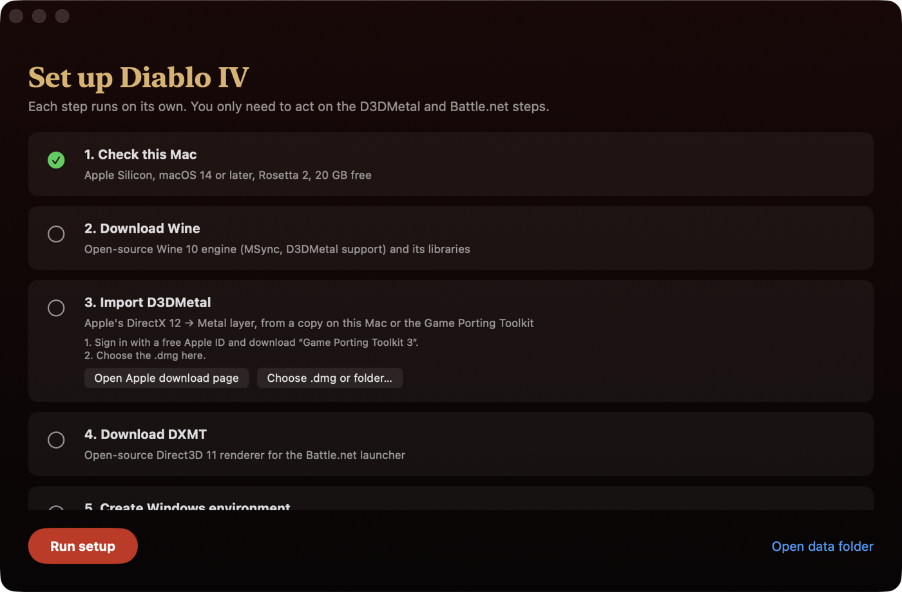
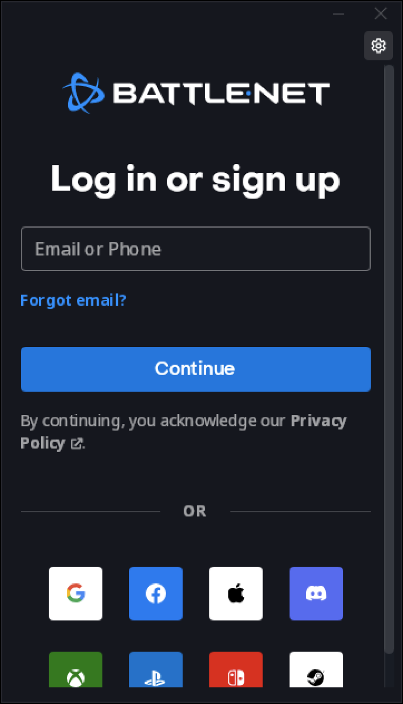
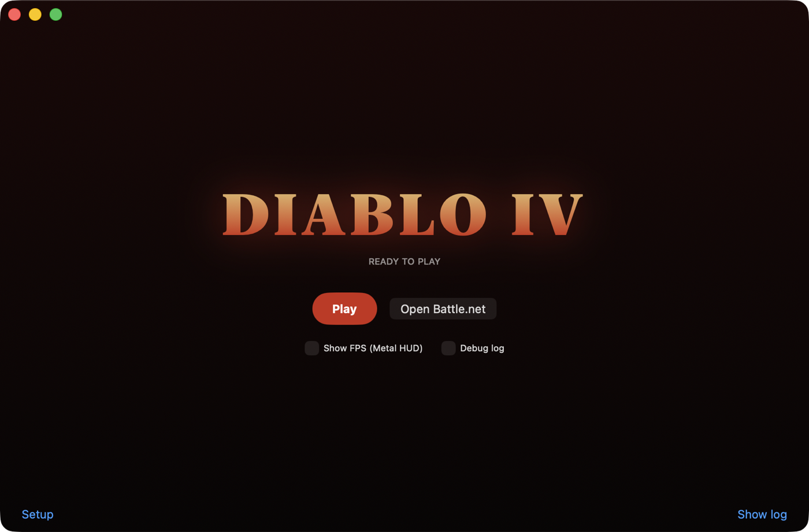
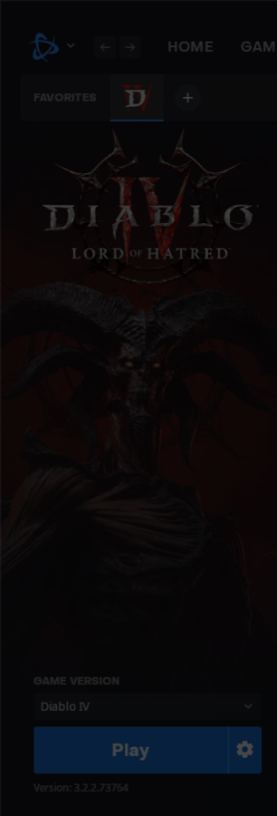

# D4Mac

A free, open-source launcher that runs the Windows (Battle.net) version of **Diablo IV** on
Apple Silicon Macs. It puts together public parts: Wine, Apple's D3DMetal, and DXMT.

You still need your own Diablo IV license and Battle.net account. D4Mac does not include
any game files, Blizzard software or Apple software.

## Download

**[⬇ Download D4Mac.dmg](https://github.com/nubela/diablo-4-on-mac/releases/latest/download/D4Mac.dmg)**
(or [D4Mac.zip](https://github.com/nubela/diablo-4-on-mac/releases/latest/download/D4Mac.zip))

GitHub Actions builds both from this repository's source.
Every commit's build is also on the [Actions page](https://github.com/nubela/diablo-4-on-mac/actions/workflows/build.yml).

**Tested:** MacBook Pro M4 Pro, macOS 26.5.2, Diablo IV 3.2.2 (Battle.net). Gets in game to character select.

**Needs:** an Apple Silicon Mac (M1 or later), macOS 14 or later, 100–160 GB free for the game (160 GB with high-resolution textures).

## Play Diablo IV on your Mac

### 1. Install the app

Open `D4Mac.dmg` and drag **D4Mac** into **Applications**.

D4Mac is not signed with a paid Apple developer certificate, so the first time you open it
macOS says it "cannot be opened". To allow it:
open **System Settings → Privacy & Security**, scroll down and click **Open Anyway** next to D4Mac.
(Or run `xattr -dr com.apple.quarantine /Applications/D4Mac.app` in Terminal.)

### 2. Run setup

Open D4Mac and click **Run setup**. Each step downloads or prepares one part and turns green.



Step 3, **Import D3DMetal**, needs Apple's DirectX 12 → Metal layer. D4Mac cannot ship it,
so get it once from Apple:

1. Click **Open Apple download page** and sign in with a free Apple ID.
2. Download **Game Porting Toolkit 3** (`.dmg`) into your Downloads folder.
3. D4Mac finds it by itself. Or click **Choose .dmg or folder…** and pick it.

### 3. Sign in to Battle.net

The last setup step installs Blizzard's official Battle.net launcher. Click through the
installer, then sign in with your own Blizzard account.



If Battle.net offers to install Diablo IV, click **Install** (100–160 GB), or
**Locate the game** if you already have the files in
`C:\Program Files (x86)\Diablo IV`.

### 4. Press Play

When setup is done, D4Mac shows the Play screen. Click **Play**: D4Mac opens Battle.net
and starts Diablo IV.





Tick **Show FPS (Metal HUD)** to see the frame rate in the game.
The game takes its settings from Battle.net, so if Battle.net is already open with other
settings, D4Mac restarts it when you press **Play**.
Click **Stop** to close Battle.net and the game.

## Already have Diablo IV from GameToMac?

D4Mac finds an existing Battle.net install from GameToMac and clones it with APFS. This
takes about a second and uses no extra disk space, and GameToMac's own files stay unchanged.
It also re-uses the D3DMetal copy GameToMac downloaded, so you can skip the Apple download.

## Troubleshooting

### Battle.net update stays at 0%

Before it updates a game, Battle.net's background downloader (the "Agent") first updates
itself. In Wine it often downloads its own files again on each start. If your account uses
the Asia region, the Agent downloads from `blizzard.gcdn.cloudn.co.kr` first. This server can
be very slow outside Korea (1–50 KB/s). It does not fail, so the Agent does not change to a
faster server, and the game update waits behind it.

To fix it, block that server. The Agent then uses the next server (`kr.cdn.blizzard.com`).
Run this in Terminal (it asks for your password):

```sh
osascript -e 'do shell script "echo \"0.0.0.0 blizzard.gcdn.cloudn.co.kr\" >> /etc/hosts && dscacheutil -flushcache && killall -HUP mDNSResponder" with administrator privileges'
```

Then click **Stop** in D4Mac and open Battle.net again. To undo, remove that line from
`/etc/hosts`.

To check the cause, look at the newest `AgentUpdate-*.log` in
`~/Library/Application Support/D4Mac/prefix/drive_c/ProgramData/Battle.net/Agent/Agent.*/Logs/`.
If `agent Update Progress` goes up very slowly, you have this problem.

## Build from source

Needs Apple's Command Line Tools (`xcode-select --install`). Xcode is not required.

```sh
scripts/build-app.sh      # → dist/D4Mac.app
scripts/make-dmg.sh       # → dist/D4Mac.dmg and dist/D4Mac.zip
scripts/test.sh           # unit tests
```

To publish a release, create one on GitHub (**Releases → Draft a new release**, any tag
name, e.g. `v0.2.0`) and click **Publish**. GitHub Actions builds `D4Mac.dmg` and
`D4Mac.zip` from that tag and attaches them, which makes the download links above work.
To add the files to a release that already exists, run the **Build** workflow by hand
(Actions → Build → Run workflow) and enter the release's tag.

There is also a command-line tool with the same features:

```sh
swift run d4mac status
swift run d4mac setup                     # all steps that are not done
swift run d4mac setup --d3dmetal ~/Downloads/Game_Porting_Toolkit_3.0.dmg d3dmetal
swift run d4mac play --hud                # Battle.net + Diablo IV, with the Metal FPS HUD
swift run d4mac stop
eval "$(swift run d4mac env)"; wine winecfg   # manual Wine commands
```

Data lives in `~/Library/Application Support/D4Mac/` (runtime, Windows prefix, logs).
To remove everything, delete that folder. Set `D4MAC_DATA_ROOT` to use another folder.

## How it works

See [docs/SPEC.md](docs/SPEC.md) for the parts, the folder layout, and every environment
setting.

## Licenses

D4Mac is MIT licensed. Downloaded parts keep their own licenses. See [THIRD_PARTY.md](THIRD_PARTY.md).
